# How to encrypt existing not-encrypted EC2 instance volume

## Scenario

It's quite common to launch EC2 instances with unencrypted Elastic Block Store (EBS) volumes, particularly when encryption is not enabled by default or when the instance is using older volumes that were not created with encryption in mind. This can pose a security risk in some environments, especially if sensitive data is stored on those volumes. If you find yourself in a situation where you need to encrypt an existing EC2 instance's unencrypted volume, you will need to perform a few steps to migrate the data to a new encrypted volume.

Encryption is a valuable security measure because it helps protect data at rest by ensuring that all data written to the volume is automatically encrypted using AWS Key Management Service (KMS) encryption keys.

This guide walks you through the steps required to encrypt an existing EC2 volume that is not encrypted, while keeping the instance running with minimal downtime.

## Steps

1. Review the current EC2 Storage (EC2 > Instances).
    - Take note of the `Device name` of the volume (***IMPORTANT**).
    - Click on the `Volume ID` link to navigate to the Volume page.

    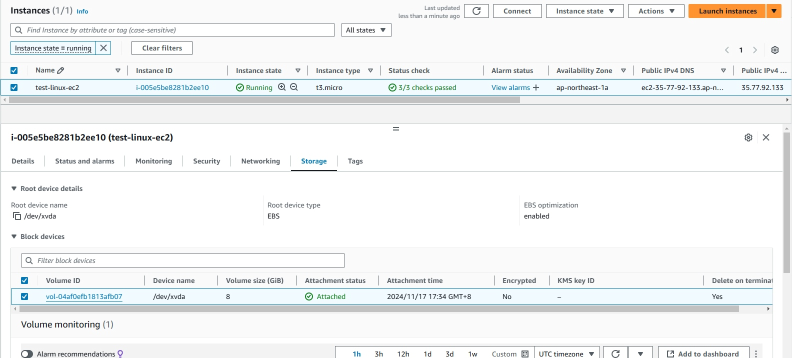

1. Stop the EC2 instance.  
    Notes:
        - Stopping the instance is optional, but it helps to avoid any potential issues with data consistency when copying or migrating data. If you can afford brief downtime, it's a good practice to stop the instance.
        - To reduce downtime, EC2 can also be stopped after encrypted volume is created (from the unencrypted snapshot). 

    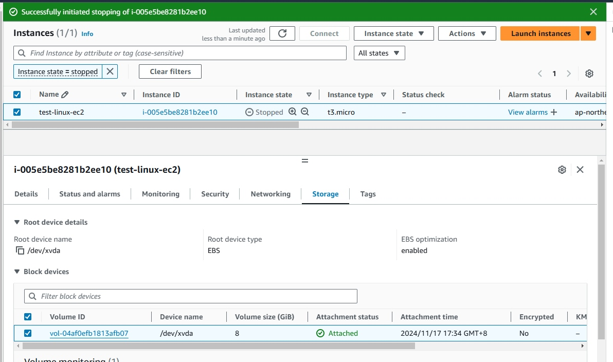

1. Create a snapshot of the unencrypted volume.  

    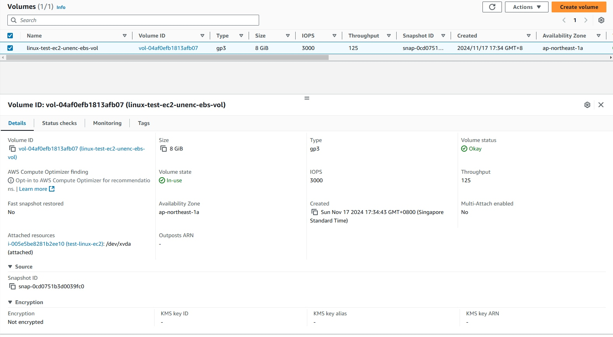

1. Create encrypted volume from the snapshot.  
    - Wait for the snapshot status is `Completed'.  

    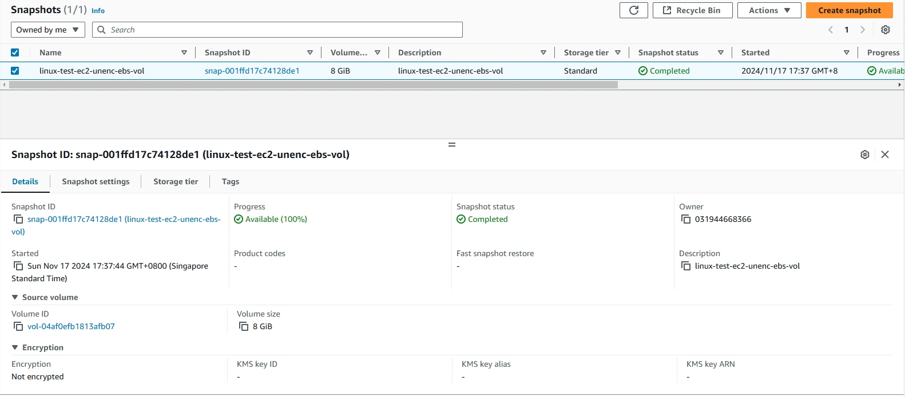

    - Right click on the snapshot and select `Create volume from snapshot`.  

    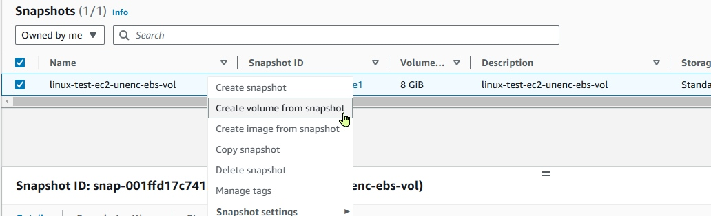  

    - Select the same **AZ (Availability Zone)** as the current EC2. Tick `Encrypt this volume` on the Encryption section. Select `KMS key`.  

    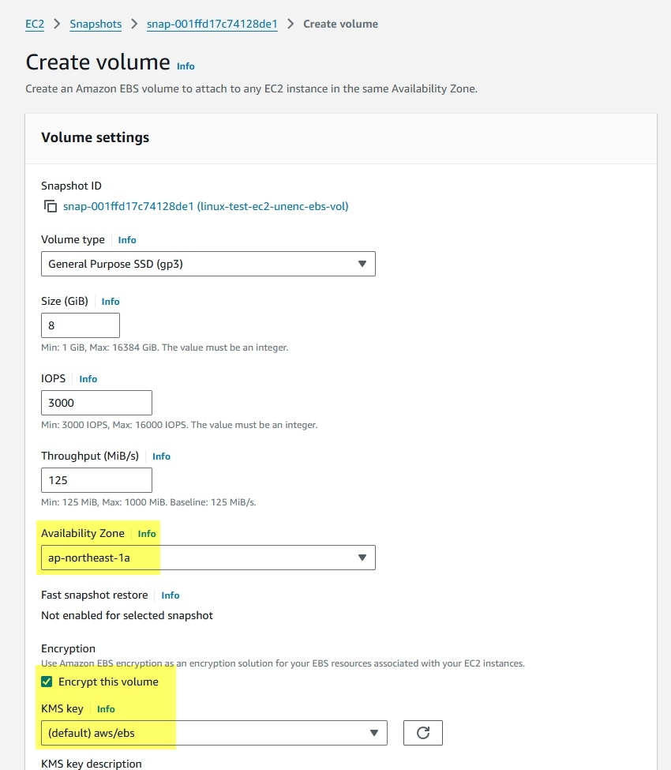  
    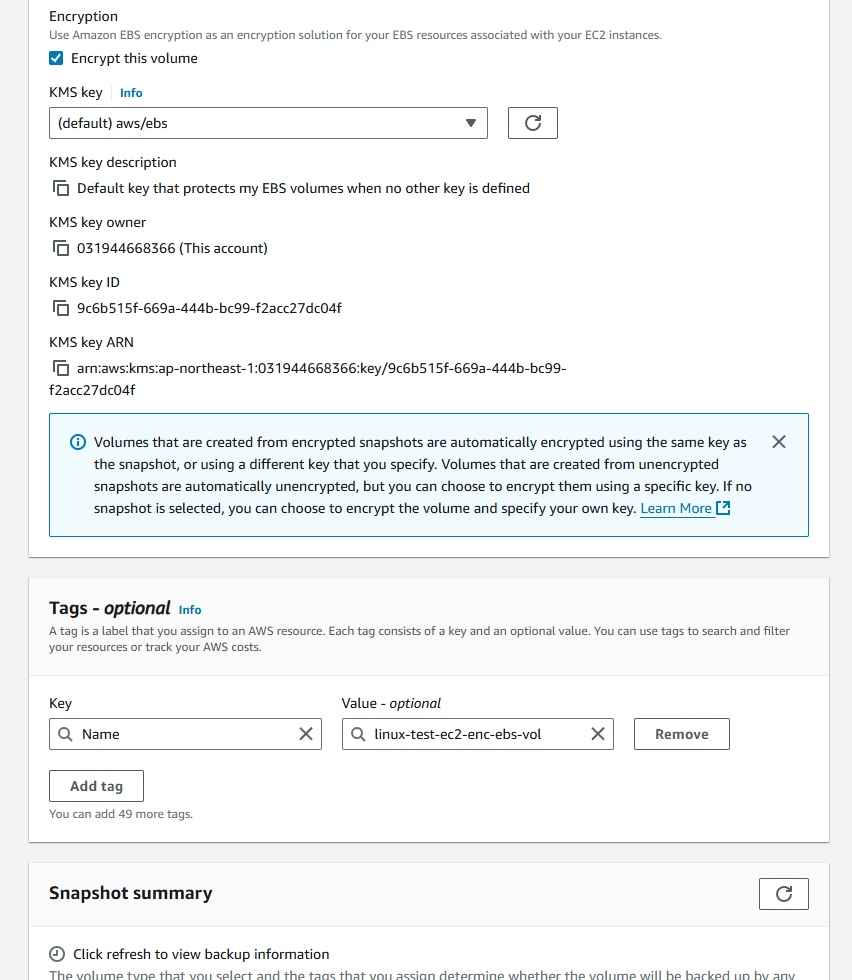  
    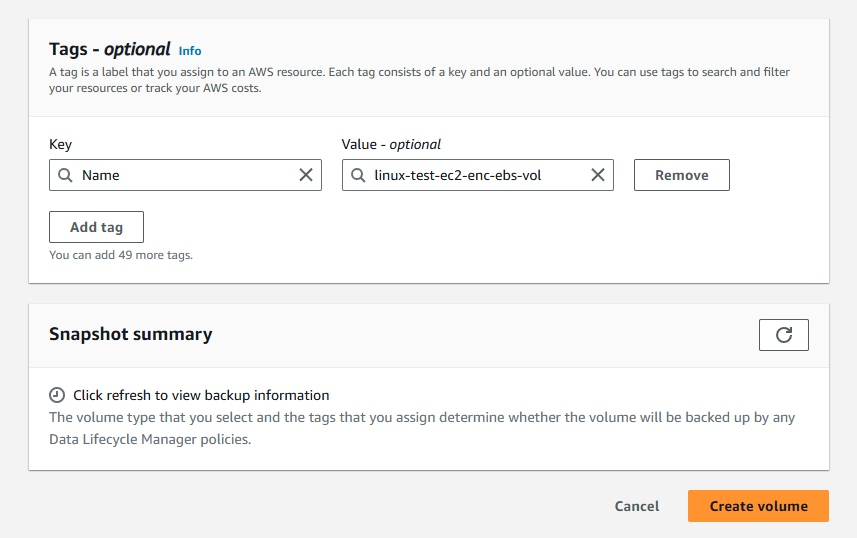  

    - Click `Create volume`.  

    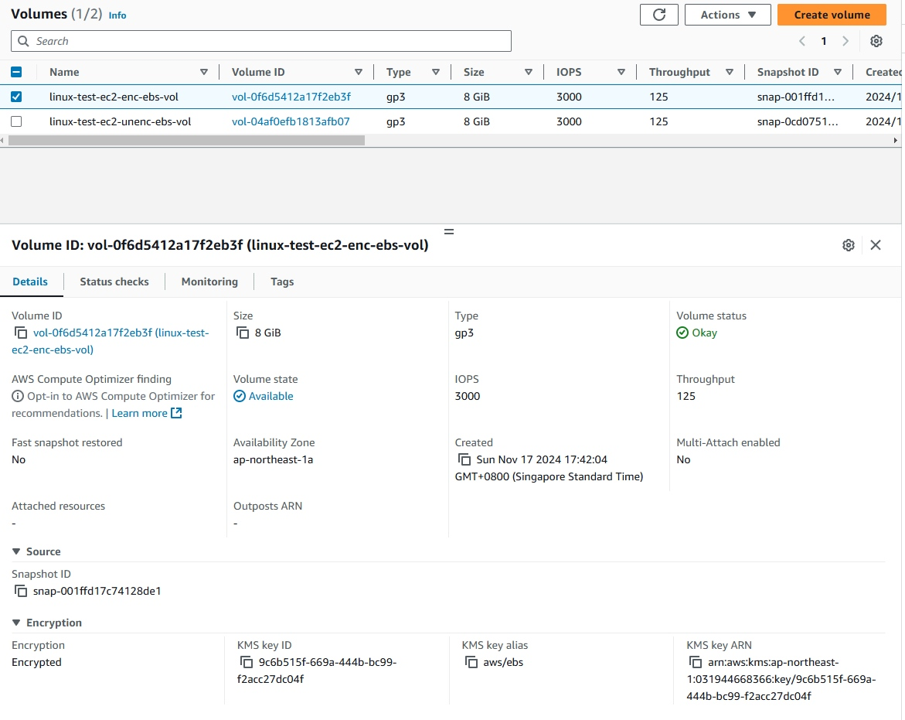  

1. Detach the unencrypted volume.  
    - Right click > Detach volume  

    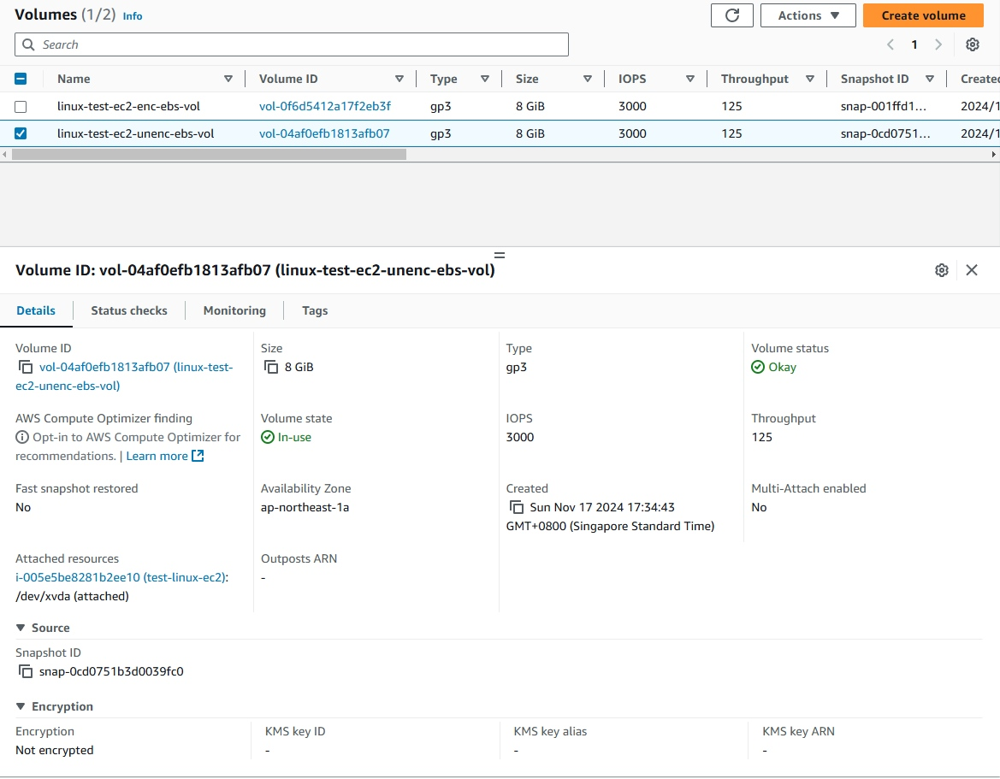  

    - Volume status will change from `In-use` to `Available`.  

    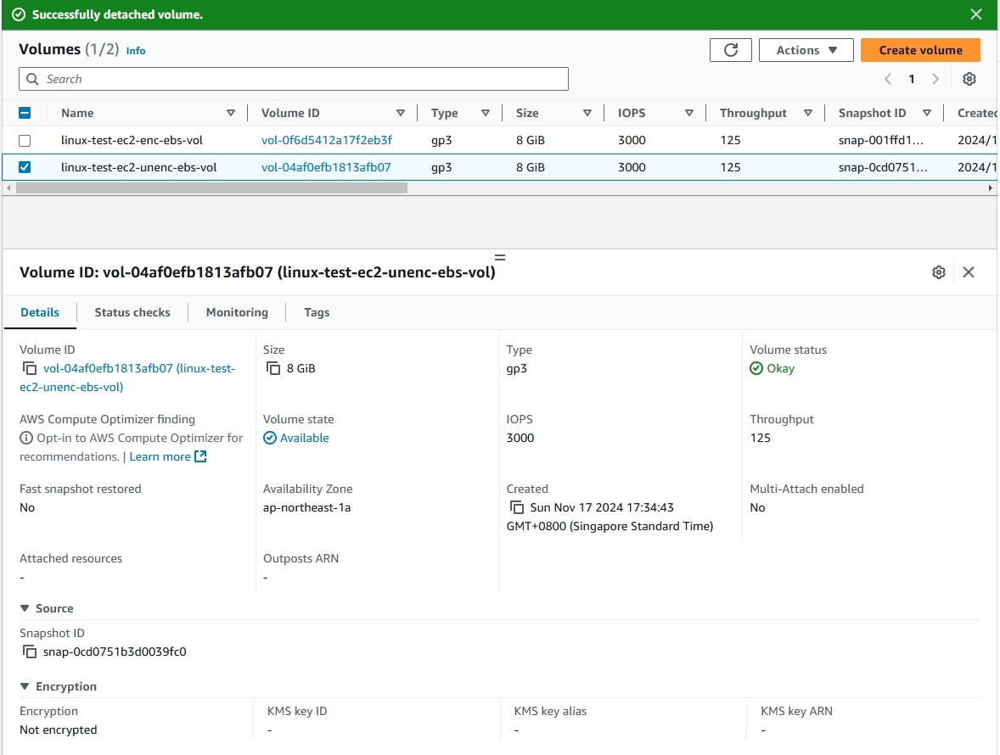  

1. Attach the encrypted volume.
    - Attach the encrypted volume to the EC2 instance.  

      
    - Select the correct `Device name` based on the data you have noted previously.  

    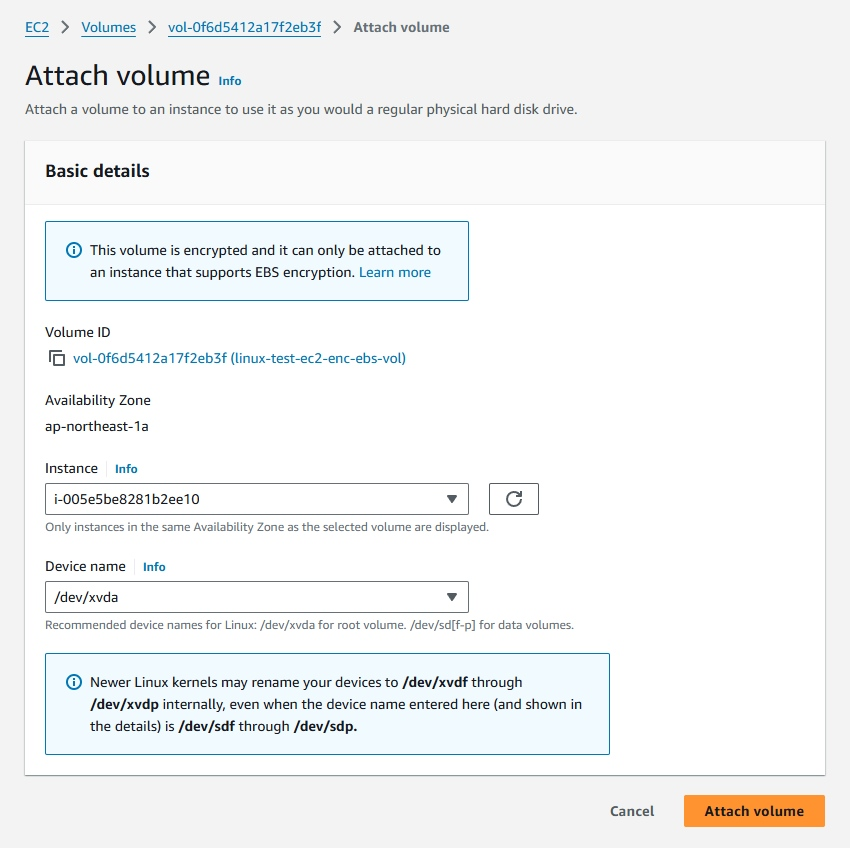  

1. Start the EC2 instance.  
    - Verify that the instance is working with the encrypted volume.  

    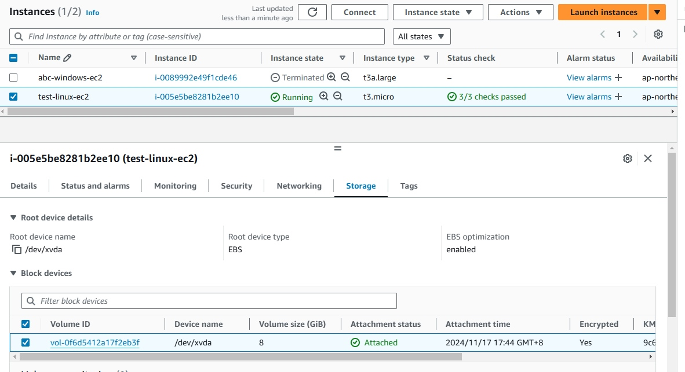  
    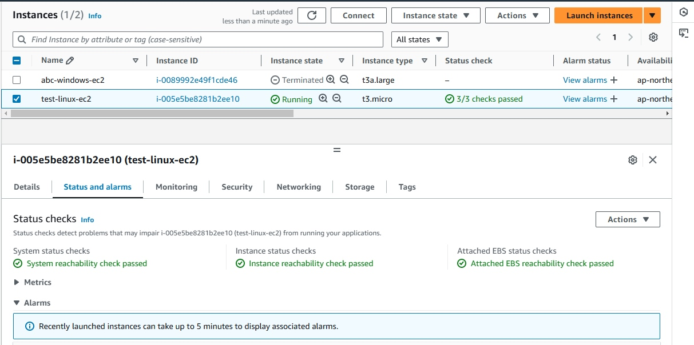  

## References

> **Encrypt unencrypted resources**  
You cannot directly encrypt existing unencrypted volumes or snapshots. However, you can create encrypted volumes or snapshots from unencrypted volumes or snapshots. If you enable encryption by default, Amazon EBS automatically encrypts new volumes and snapshots using your default KMS key for EBS encryption. Otherwise, you can enable encryption when you create an individual volume or snapshot, using either the default KMS key for Amazon EBS encryption or a symmetric customer managed encryption key. For more information, see Create an Amazon EBS volume and Copy an Amazon EBS snapshot.

- [EBS Encryption](https://docs.aws.amazon.com/ebs/latest/userguide/ebs-encryption.html)
- [How EBS Encryption works](https://docs.aws.amazon.com/ebs/latest/userguide/how-ebs-encryption-works.html)
- [EBS Encryption examples](https://docs.aws.amazon.com/ebs/latest/userguide/encryption-examples.html)
