# How to import on-premises Virtual Machine (VM) to AWS EC2

## Scenario

There are times when we would like to launch VM/EC2 and that particular VM is not available as AMI in AWS EC2.
Possible use cases such as:
1. Bring in your on-premises Virtual Machine to AWS EC2.
1. Launch obsolete/outdated OS, such as Windows Server 2012 R2.
1. Launch client OS, like running Windows 10 or 11 in AWS EC2.

## Import Steps

### 1. Create / prepare / download Virtual Harddisk of the target VM

Some options that we can use.
- [Windows Server 2012 R2](https://www.microsoft.com/en-us/evalcenter/download-windows-server-2012-r2) > select `VHD download`

### 2. Pre-requisites

1. [AWS Account](https://console.aws.amazon.com/)
1. Install and configure AWS CLI v2
    - [Install](https://docs.aws.amazon.com/cli/latest/userguide/getting-started-install.html)
    - [Configure](https://docs.aws.amazon.com/cli/latest/userguide/cli-chap-authentication.html)
1. Budget of about USD2.00-5.00

### 3. Upload Virtual Harddisk to S3

1. **Create new S3 Bucket**  
If you want to use existing bucket, you can skip this step.

    ```
    # Create S3 Bucket
    aws s3 mb s3://<UNIQUE_BUCKET_NAME> --region ap-southeast-1

    # Add tags to S3 Bucket
    aws s3api put-bucket-tagging --region ap-southeast-1 --bucket <UNIQUE_BUCKET_NAME> --tagging "TagSet=[{Key=CostCenter, Value=EC2 Import Demo},{Key=Department, Value=Infra}]"
    ```

    **Notes**:
    - Change the bucket name - s3 bucket name must be unique (not only unique in your account).
    - Ensure that [**Block public access**](https://docs.aws.amazon.com/AmazonS3/latest/userguide/access-control-block-public-access.html?icmpid=docs_amazons3_console) is enabled on the bucket.

1. Upload Virtual Harddisk to S3 Bucket

    ```
    # Upload file to S3 Bucket
    aws s3 cp --region ap-southeast-1 "C:\PATH_TO_YOUR_WINDOWS_VM\9600.16415.amd64fre.winblue_refresh.130928-2229_server_serverdatacentereval_en-us.vhd" s3://<UNIQUE_BUCKET_NAME>/win2012r2-9600.16415.vhd
    ```

    While waiting for the upload, proceed to next step.

### Create IAM Role for EC2 Import Task

1. Create a trust policy file, save to your local disk.

    ```
    {
        "Version": "2012-10-17",
        "Statement": [
            {
                "Effect": "Allow",
                "Principal": { "Service": "vmie.amazonaws.com" },
                "Action": "sts:AssumeRole",
                "Condition": {
                    "StringEquals":{
                    "sts:Externalid": "vmimport"
                    }
                }
            }
        ]
    }
    ```

1. Create IAM role from AWS CLI.

    1. Create trust policy json file - `trust-policy.json`.
    1. Create IAM Role - `team99-vmimport-role`.
        ```
        aws iam create-role --role-name team99-vmimport-role --assume-role-policy-document "file://C:\PATH_TO_YOUR_FILE\trust-policy.json"
        ```

    1. Create role policy file - `role-policy.json`.
        ```
            {
                "Version": "2012-10-17",
                "Statement": [
                    {
                        "Effect": "Allow",
                        "Action": [
                            "s3:GetBucketLocation",
                            "s3:GetObject",
                            "s3:ListBucket"
                        ],
                        "Resource": [
                            "arn:aws:s3:::<UNIQUE_BUCKET_NAME>",
                            "arn:aws:s3:::<UNIQUE_BUCKET_NAME>/*"
                        ]
                    },
                    {
                        "Effect": "Allow",
                        "Action": [
                            "s3:GetBucketLocation",
                            "s3:GetObject",
                            "s3:ListBucket",
                            "s3:PutObject",
                            "s3:GetBucketAcl"
                        ],
                        "Resource": [
                            "arn:aws:s3:::<UNIQUE_BUCKET_NAME>",
                            "arn:aws:s3:::<UNIQUE_BUCKET_NAME>/*"
                        ]
                    },
                    {
                        "Effect": "Allow",
                        "Action": [
                            "ec2:ModifySnapshotAttribute",
                            "ec2:CopySnapshot",
                            "ec2:RegisterImage",
                            "ec2:Describe*"
                        ],
                        "Resource": "*"
                    },
                    {
                        "Effect": "Allow",
                        "Action": [
                            "license-manager:GetLicenseConfiguration",
                            "license-manager:UpdateLicenseSpecificationsForResource",
                            "license-manager:ListLicenseSpecificationsForResource"
                        ],
                        "Resource": "*"
                    }
                ]
            }
        ```

    1. Attach role policy to IAM Role.
        ```
        aws iam put-role-policy --role-name team99-vmimport-role --policy-name s3bucket-read-write-import --policy-document "file://C:\PATH_TO_YOUR_FILE\role-policy.json"
        ```

    1. Open the IAM console at https://console.aws.amazon.com/iam/.
    1. In the navigation pane, choose **Roles**.

        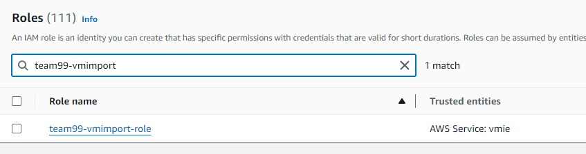

### Create EC2 AMI from Virtual Harddisk

1. Wait for upload progress to complete. Once upload completed, check the harddisk in S3 bucket.
    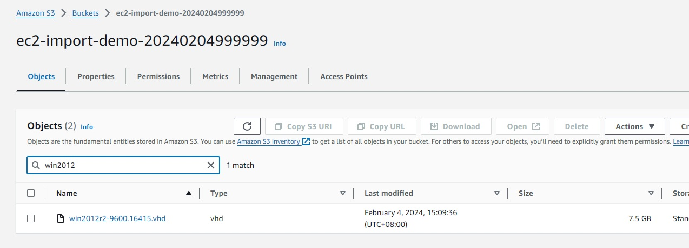

1. Create container manifest file in your local disk - `ec2-containers.json`

    ```
    [
        {
            "Description": "hvwindows2012r2",
            "Format": "vhd",
            "Url": "s3://<UNIQUE_BUCKET_NAME>/win2012r2-9600.16415.vhd"
        }
    ]
    ```

1. Perform import task from CLI.

    ```
    aws ec2 import-image --region ap-southeast-1 --description "Windows 2012 R2" --disk-containers "file://C:\PATH_TO_CONTAINER_FILE\ec2-containers.json" --role-name "team99-vmimport-role" --tag-specifications ResourceType=import-image-task,Tags=[{Key=Name,Value=win2012r2-ec2-image},{Key=CostCenter,Value="EC2 Import Demo"},{Key=Department,Value=Infra}]
    ```

    Sample output.

    ```
    {
        "Description": "Windows 2012 R2",
        "ImportTaskId": "import-ami-0e00aabd6fb70e2d5",
        "Progress": "1",
        "SnapshotDetails": [
            {
                "Description": "hvwindows2012r2",
                "DiskImageSize": 0.0,
                "Format": "VHD",
                "Url": "s3://ec2-import-demo-20240204999999/win2012r2-9600.16415.vhd",
                "UserBucket": {
                    "S3Bucket": "ec2-import-demo-20240204999999",
                    "S3Key": "win2012r2-9600.16415.vhd"
                }
            }
        ],
        "Status": "active",
        "StatusMessage": "pending",
        "Tags": [
            {
                "Key": "Name",
                "Value": "win2012r2-ec2-image"
            },
            {
                "Key": "CostCenter",
                "Value": "EC2 Import Demo"
            },
            {
                "Key": "Department",
                "Value": "Infra"
            }
        ]
    }
    ```

1. This process will take quite some time (roughly 20-30 mins for Windows 2012 R2 import task). To check progress, grab the `ImportTaskId` and enter the `describe-import-image-tasks` command.

    ```
    > aws ec2 describe-import-image-tasks --region ap-southeast-1 --import-task-ids import-ami-0e00aabd6fb70e2d5

    {
        "ImportImageTasks": [
            {
                "Description": "Windows 2012 R2",
                "ImportTaskId": "import-ami-0e00aabd6fb70e2d5",
                "Progress": "19",
                "SnapshotDetails": [
                    {
                        "Description": "hvwindows2012r2",
                        "DiskImageSize": 8024756224.0,
                        "Format": "VHD",
                        "Status": "active",
                        "Url": "s3://ec2-import-demo-20240204999999/win2012r2-9600.16415.vhd",
                        "UserBucket": {
                            "S3Bucket": "ec2-import-demo-20240204999999",
                            "S3Key": "win2012r2-9600.16415.vhd"
                        }
                    }
                ],
                "Status": "active",
                "StatusMessage": "converting",
                "Tags": [
                    {
                        "Key": "CostCenter",
                        "Value": "EC2 Import Demo"
                    },
                    {
                        "Key": "Department",
                        "Value": "Infra"
                    },
                    {
                        "Key": "Name",
                        "Value": "win2012r2-ec2-image"
                    }
                ]
            }
        ]
    }
    ```

    Notable Progress - StatusMessage:

    | Progress | Status |
    |  ---     | ---    | 
    |   1 | pending
    |  19 | converting
    |  39 | booting
    |  57 | preparing ami
    | 100 | completed

1. When the import process is completed, you can see the AMI in your AWS EC2 console - in the region that you specified.

    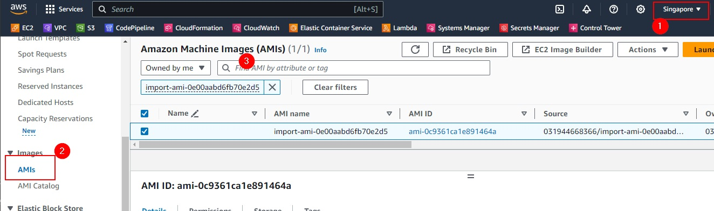

    Name it to something that you can identify later, e.g. `app99-win2012r2-ami`

    **Notes:**  
    - Each AMI will also come with Storage in the form of EC2 Snapshots.
    - To verify Snapshots used by AMI, check on AMI > Storage tab.
    - To cancel import task, use `ec2 cancel-import-task`.
        ```
        aws ec2 cancel-import-task --region ap-southeast-1 --import-task-id import-ami-0124aff44c9b3411f
        ```

### Launch EC2 from the AMI

1. Create IAM Instance Profile to use SSM Fleet Manager.

    1. Open the IAM console at https://console.aws.amazon.com/iam/.
    1. In the navigation pane, choose **Roles**, and then choose **Create role**.
    1. For Trusted entity type, choose **AWS service**.
    1. Immediately under Use case, choose **EC2**, and then choose **Next**.
    1. On the **Add permissions** page, do the following:
        - Use the Search field to locate the **AmazonSSMManagedInstanceCore** policy. Select the check box next to its name.
        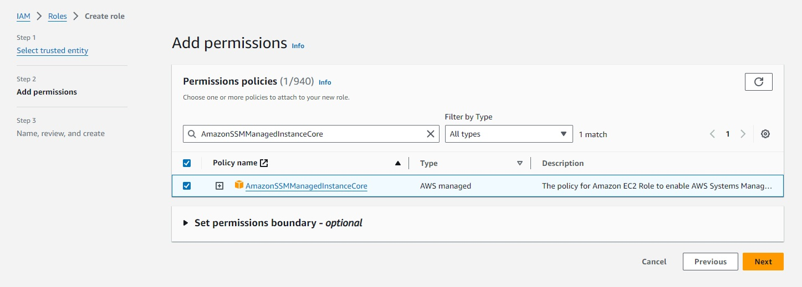
        - If you plan to join instances to an Active Directory managed by AWS Directory Service, search for **AmazonSSMDirectoryServiceAccess** and select the check box next to its name.
        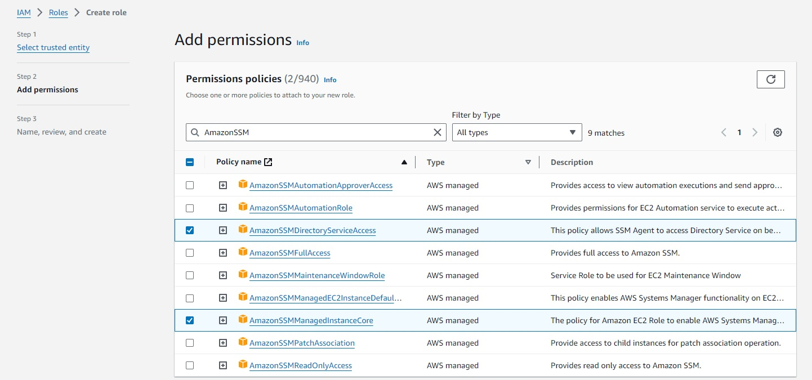
        - If you plan to use EventBridge or CloudWatch Logs to manage or monitor your instance, search for **CloudWatchAgentServerPolicy** and select the check box next to its name.
        
    1. Choose Next.
    1. For Role name, enter a name for your new instance profile, such as `team99-ec2-fleet-role`. Then choose **Create role**. The system returns you to the **Roles** page.
    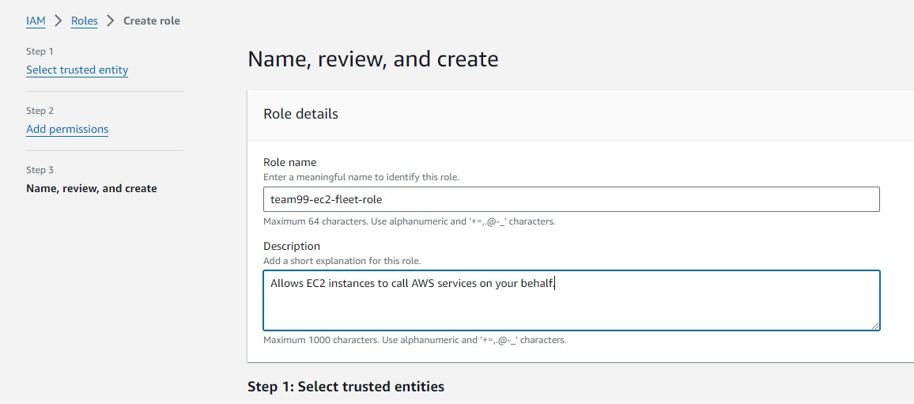
    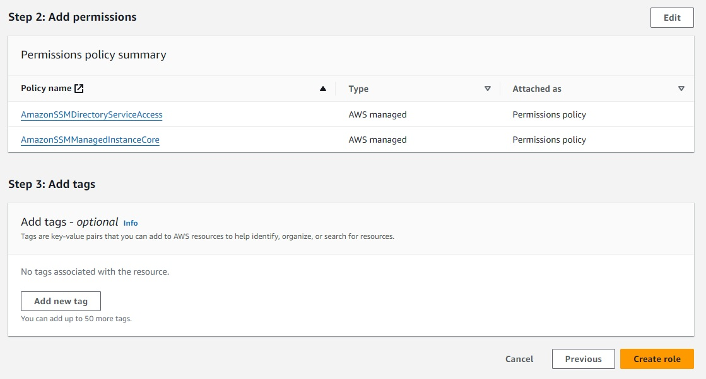
    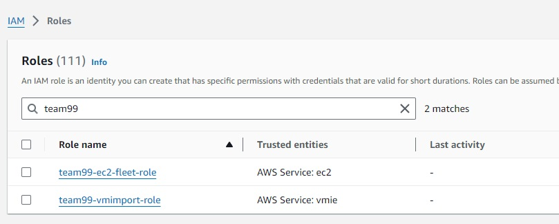

1. Create EC2 Security Group in default VPC - name it `team99-ec2-importdemo-sg`. Leave inbound rules empty and outbound rules as-is.
    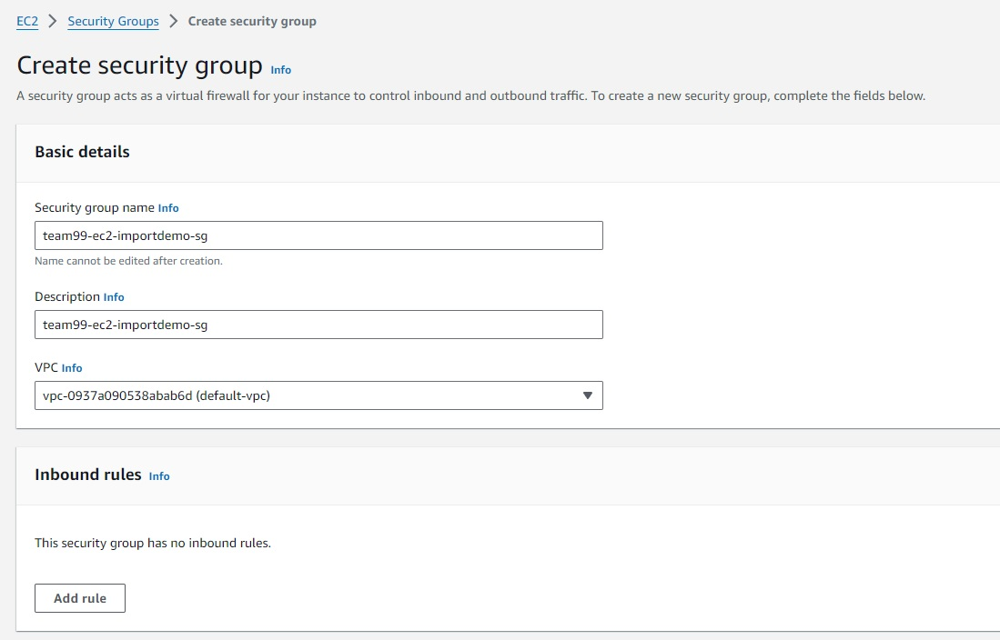

1. From **AMIs** > Owned by me > select the newly created AMI and click **Launch instance from AMI**.
    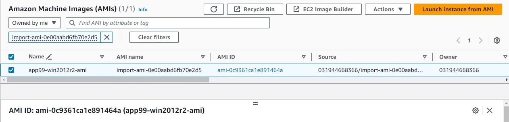

    - Enter EC2 name, e.g. `app99-demo-win2012r2-ec2`.
    - Select instance type, like `m6a.large`.
    - For key pair, select `Proceed without a key pair`.
    - Select existing security group that was created earlier - `team99-ec2-importdemo-sg`.
    - Select `gp3` storage type.
    - Expand **Advanced details**, select `team99-ec2-fleet-role` for IAM instance profile.
    - (Optional) In user data textbox, enter.
        ```
        <script>
        net user Administrator /active:yes
        </script>
        ```

    - Leave the rest as-is, click **Launch instance**.

1. After EC2 is ready, click Connect > Session Manager tab > Connect. This will open session terminal in browser. Enter this to reset password for Administrator.

        net user Administrator Some-Random-Password-Here

1. Navigate to **Systems Manager** > **Fleet Manager** in your selected region.
    - Connect with Remote Desktop.
        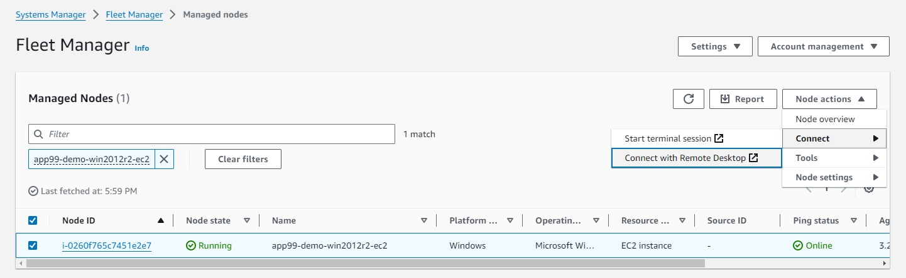
    - Enter `Administrator` for username.
    - Enter password that you specified earlier.
    - Click **Connect**.
        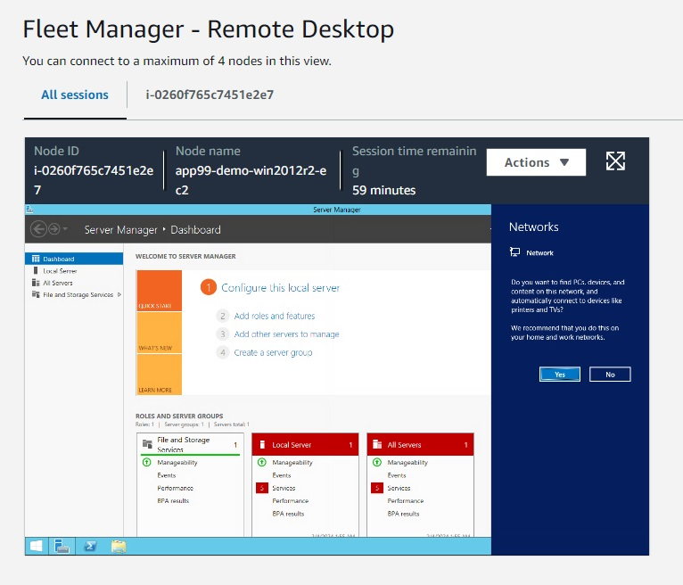
        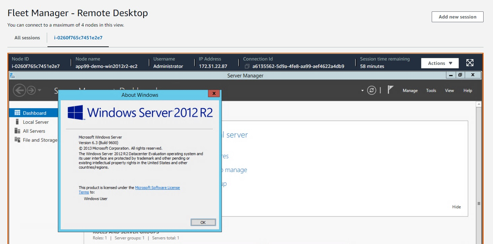

1. Terminate the instance once you are done.

### Cleanup
To ensure that you won't be charged for any further usage, delete all the following resources.

1. Delete all Virtual harddisk files you have uploaded in S3 Bucket.
1. Delete the S3 bucket.
1. Terminate EC2 instances.
1. Deregister AMI (EC2 > AMIs > Select AMI and deregister it).
1. Delete snapshots associated with the AMI (EC2 > Snapshots > find the snapshot and delete it).

## Side Note - Import and launch Windows 10

1. Download old Windows 10 virtual harddisk from [Archive](https://web.archive.org/web/20200612045637/https://developer.microsoft.com/en-us/windows/downloads/virtual-machines/). 
    - VMWare https://download.microsoft.com/download/b/7/a/b7a6fb6e-cae1-4e19-9249-205803bc4ada/WinDev2004Eval.VMware.zip
    - VirtualBox https://download.microsoft.com/download/2/d/2/2d2f760e-aaa7-4268-9904-b5c0260cfd3b/WinDev2004Eval.VirtualBox.zip

1. Upload virtual harddisk to S3 bucket.
    
        aws s3 cp --region ap-southeast-1 "C:\PATH_TO_YOUR_WINDOWS_VM\WinDev2004Eval-disk1.vmdk" s3://<UNIQUE_BUCKET_NAME>/WinDev2004Eval-disk1.vmdk

1. Create container manifest file in your local disk - `ec2-containers.json`

    ```
    [
        {
            "Description": "win10devtest",
            "Format": "vmdk",
            "Url": "s3://<UNIQUE_BUCKET_NAME>/WinDev2004Eval-disk1.vmdk"
        }
    ]
    ```

1. Perform import task from CLI.

    ```
    aws ec2 import-image --region ap-southeast-1 --description "Windows 10 Dev 2004" --disk-containers "file://C:\PATH_TO_CONTAINER_FILE\ec2-containers.json" --role-name "team99-vmimport-role" --tag-specifications ResourceType=import-image-task,Tags=[{Key=Name,Value=win10-ec2-image},{Key=CostCenter,Value="EC2 Import Demo"},{Key=Department,Value=Infra}]
    ```

    Sample output.
    ```
    {
        "Description": "Windows 10 Dev 2004",
        "ImportTaskId": "import-ami-015a33ba399ae37a9",
        "Progress": "1",
        "SnapshotDetails": [
            {
                "Description": "win10devtest",
                "DiskImageSize": 0.0,
                "Format": "VMDK",
                "Url": "s3://ec2-import-demo-20240204999999/WinDev2004Eval-disk1.vmdk",
                "UserBucket": {
                    "S3Bucket": "ec2-import-demo-20240204999999",
                    "S3Key": "WinDev2004Eval-disk1.vmdk"
                }
            }
        ],
        "Status": "active",
        "StatusMessage": "pending",
        "Tags": [
            {
                "Key": "Name",
                "Value": "win10-ec2-image"
            },
            {
                "Key": "CostCenter",
                "Value": "EC2 Import Demo"
            },
            {
                "Key": "Department",
                "Value": "Infra"
            }
        ]
    }
    ```

1. This process will take quite some time. To check progress, grab the `ImportTaskId` and enter the `describe-import-image-tasks` command.

    ```
    > aws ec2 describe-import-image-tasks --region ap-southeast-1 --import-task-ids import-ami-015a33ba399ae37a9

    {
        "ImportImageTasks": [
            {
                "Description": "Windows 10 Dev 2004",
                "ImportTaskId": "import-ami-015a33ba399ae37a9",
                "Progress": "19",
                "SnapshotDetails": [
                    {
                        "Description": "win10devtest",
                        "DiskImageSize": 19020283392.0,
                        "Format": "VMDK",
                        "Status": "active",
                        "Url": "s3://ec2-import-demo-20240204999999/WinDev2004Eval-disk1.vmdk",
                        "UserBucket": {
                            "S3Bucket": "ec2-import-demo-20240204999999",
                            "S3Key": "WinDev2004Eval-disk1.vmdk"
                        }
                    }
                ],
                "Status": "active",
                "StatusMessage": "converting",
                "Tags": [
                    {
                        "Key": "CostCenter",
                        "Value": "EC2 Import Demo"
                    },
                    {
                        "Key": "Department",
                        "Value": "Infra"
                    },
                    {
                        "Key": "Name",
                        "Value": "win11-ec2-image"
                    }
                ]
            }
        ]
    }
    ```

1. When the import process is completed, check the AMI in your AWS EC2 console - in the region that you specified. Name it to something that you can identify later, e.g. `app99-win10dev-ami`
1. Launch EC2 from the AMI. From **AMIs** > Owned by me > select the newly created AMI and click **Launch instance from AMI**.
    - Enter EC2 name, e.g. `app99-demo-win10-ec2`.
    - Select instance type, like `m6a.large`.
    - For key pair, select `Proceed without a key pair`.
    - Select existing security group that was created earlier - `team99-ec2-importdemo-sg`.
    - Select `gp3` storage type.
    - Expand **Advanced details**, select `team99-ec2-fleet-role` for IAM instance profile.
    - (Optional) In user data textbox, enter this.
        ```
        <script>
        net user User /active:no
        net user User Some-Strong-Random-Password-Here
        net user Administrator /active:yes
        </script>
        ```
        **Notes**:  

        1. Windows 10/11 Development Machine comes with user account with no password - username: `User` and the password is not set. And `Administrator` account is disabled.
        1. In above user data, we disable `User` account, and set a random password of your choosing.
        1. And we also re-enable/activate `Administrator` account.

    - Leave the rest as-is, click **Launch instance**.

1. Once EC2 is ready, click Connect > Session Manager > Connect. This will open session terminal in browser. Enter this to reset password for Administrator.

        net user Administrator Some-Strong-Random-Password-Here

1. Terminate the instance once you are done.

## Side Note - Import and launch Windows 11

As of Feb 2024, there was an issue importing Windows 11 image.

VHD source: [Windows 11 development environment](https://developer.microsoft.com/en-us/windows/downloads/virtual-machines/) > select `VirtualBox`.

Importing disk is not progressing beyond 39% after more than 2 hours.
```
{
    "ImportImageTasks": [
        {
            "Architecture": "x86_64",
            "Description": "Windows 11 Dev",
            "ImportTaskId": "import-ami-016cbb71a3e5795d7",
            "LicenseType": "BYOL",
            "Platform": "Windows",
            "Progress": "39",
            "SnapshotDetails": [
                {
                    "DeviceName": "/dev/sda1",
                    "DiskImageSize": 22724793856.0,
                    "Format": "VMDK",
                    "Status": "completed",
                    "Url": "s3://ec2-import-demo-20240204999999/WinDev2401Eval.ova",
                    "UserBucket": {
                        "S3Bucket": "ec2-import-demo-20240204999999",
                        "S3Key": "WinDev2401Eval.ova"
                    }
                }
            ],
            "Status": "active",
            "StatusMessage": "booting",
            "Tags": [
                {
                    "Key": "CostCenter",
                    "Value": "EC2 Import Demo"
                },
                {
                    "Key": "Department",
                    "Value": "Infra"
                },
                {
                    "Key": "Name",
                    "Value": "win11-ec2-image"
                }
            ],
            "BootMode": "uefi"
        }
    ]
}
```

And finally after 2-3 hours, it throws the following error.

```
{
    "ImportImageTasks": [
        {
            "Architecture": "x86_64",
            "Description": "Windows 11 Dev",
            "ImportTaskId": "import-ami-016cbb71a3e5795d7",
            "LicenseType": "BYOL",
            "Platform": "Windows",
            "SnapshotDetails": [
                {
                    "DeviceName": "/dev/sda1",
                    "DiskImageSize": 22724793856.0,
                    "Format": "VMDK",
                    "Status": "completed",
                    "Url": "s3://ec2-import-demo-20240204999999/WinDev2401Eval.ova",
                    "UserBucket": {
                        "S3Bucket": "ec2-import-demo-20240204999999",
                        "S3Key": "WinDev2401Eval.ova"
                    }
                }
            ],
            "Status": "deleted",
            "StatusMessage": "FirstBootFailure: This import request failed because the instance failed to boot and establish network connectivity.",
            "Tags": [
                {
                    "Key": "CostCenter",
                    "Value": "EC2 Import Demo"
                },
                {
                    "Key": "Department",
                    "Value": "Infra"
                },
                {
                    "Key": "Name",
                    "Value": "win11-ec2-image"
                }
            ],
            "BootMode": "uefi"
        }
    ]
}
```

## References

- [AWS VM Import](https://docs.aws.amazon.com/vm-import/latest/userguide/vmimport-image-import.html)
- [aws cli ec2 import-image](https://docs.aws.amazon.com/cli/latest/reference/ec2/import-image.html)
- [Fleet Manager required permission](https://docs.aws.amazon.com/systems-manager/latest/userguide/setup-instance-permissions.html)
